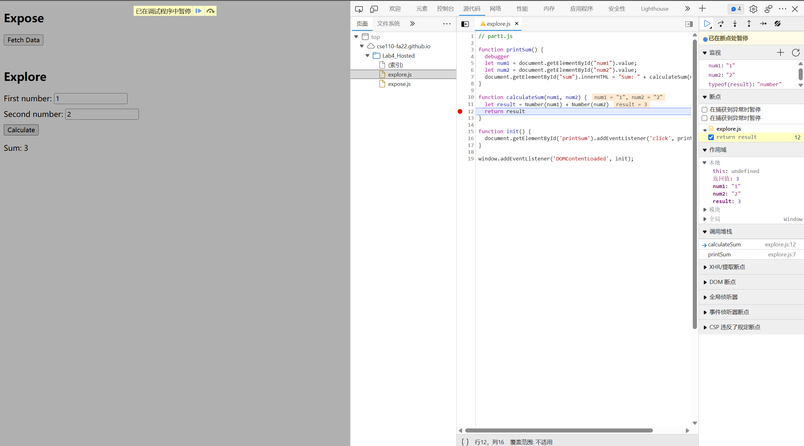

1. The bug is that the result has values added by two strings, and thus the result is also a string.
2. I'll fix it by use the number of string 1 and string 2 instead of strings of them, and let result be the sum of the two numbers.
